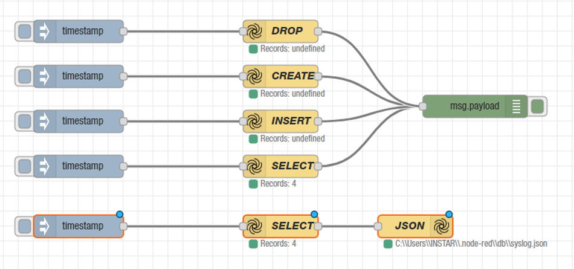

# Working with AlaSQL in Node-RED


<!-- TOC -->

- [Working with AlaSQL in Node-RED](#working-with-alasql-in-node-red)

<!-- /TOC -->


[AlaSQL](https://github.com/agershun/alasql) is an open source SQL database for Javascript with a strong focus on query speed and data source flexibility for both relational data and schemaless data. It can be added to [Node-RED](https://nodered.org) by installing the [node-red-contrib-alasql](https://www.npmjs.com/package/node-red-contrib-alasql) node. The following is a basic flow that adds DROP, CREATE, INSERT, SELECT and save-to-file SQL Operation to your Node-RED app:





```json
[{"id":"e8fd0caa.f388f","type":"alasql","z":"7bbc769a.b98c68","name":"SELECT","query":"SELECT * FROM cities","x":450,"y":960,"wires":[["a31cc7c1.44d048"]]},{"id":"a31cc7c1.44d048","type":"debug","z":"7bbc769a.b98c68","name":"","active":true,"tosidebar":true,"console":false,"tostatus":false,"complete":"false","x":710,"y":880,"wires":[]},{"id":"d2f66872.976ff8","type":"inject","z":"7bbc769a.b98c68","name":"","topic":"","payload":"","payloadType":"date","repeat":"","crontab":"","once":false,"onceDelay":0.1,"x":180,"y":960,"wires":[["e8fd0caa.f388f"]]},{"id":"b6b560e9.ea05a","type":"alasql","z":"7bbc769a.b98c68","name":"CREATE","query":"CREATE TABLE cities (city string, population number)","x":450,"y":840,"wires":[["a31cc7c1.44d048"]]},{"id":"4e91d3d9.c1b24c","type":"inject","z":"7bbc769a.b98c68","name":"","topic":"","payload":"","payloadType":"date","repeat":"","crontab":"","once":false,"onceDelay":0.1,"x":180,"y":840,"wires":[["b6b560e9.ea05a"]]},{"id":"93b165f8.f11298","type":"alasql","z":"7bbc769a.b98c68","name":"INSERT","query":"INSERT INTO cities VALUES ('Rome',2863223),('Paris',2249975),('Berlin',3517424),('Madrid',3041579)","x":450,"y":900,"wires":[["a31cc7c1.44d048"]]},{"id":"b400c605.38c058","type":"inject","z":"7bbc769a.b98c68","name":"","topic":"","payload":"","payloadType":"date","repeat":"","crontab":"","once":false,"onceDelay":0.1,"x":180,"y":900,"wires":[["93b165f8.f11298"]]},{"id":"29212d3b.dfe2b2","type":"alasql","z":"7bbc769a.b98c68","name":"DROP","query":"DROP TABLE cities","x":450,"y":780,"wires":[["a31cc7c1.44d048"]]},{"id":"573de68a.035d88","type":"inject","z":"7bbc769a.b98c68","name":"","topic":"","payload":"","payloadType":"date","repeat":"","crontab":"","once":false,"onceDelay":0.1,"x":180,"y":780,"wires":[["29212d3b.dfe2b2"]]},{"id":"82c921f4.99d2c","type":"alafile out","z":"7bbc769a.b98c68","name":"JSON","filename":"C:\\\\Users\\\\INSTAR\\\\.node-red\\\\db\\\\syslog","format":"json","columns":"*","headers":true,"x":630,"y":1040,"wires":[]},{"id":"562e7297.3cb8bc","type":"alasql","z":"7bbc769a.b98c68","name":"SELECT","query":"SELECT * FROM cities","x":450,"y":1040,"wires":[["82c921f4.99d2c"]]},{"id":"156fcb8c.12ea74","type":"inject","z":"7bbc769a.b98c68","name":"","topic":"","payload":"","payloadType":"date","repeat":"","crontab":"","once":false,"onceDelay":0.1,"x":180,"y":1040,"wires":[["562e7297.3cb8bc"]]}]
```